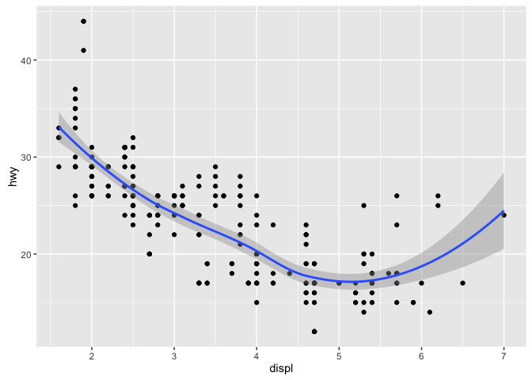
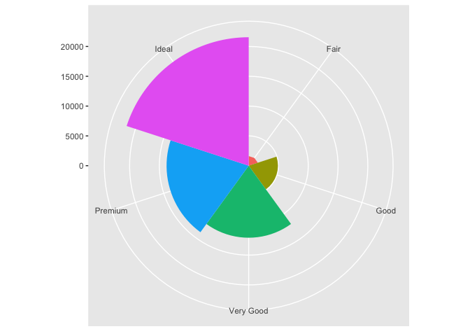
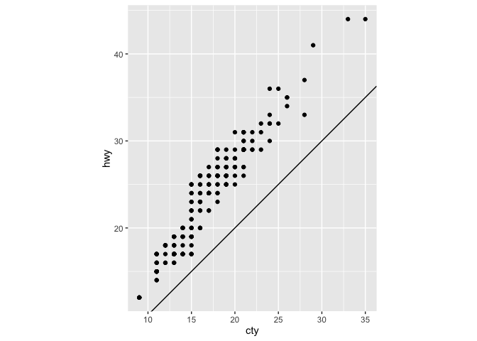

# R-club-May-3


```r
library(tidyverse)
```

```
## Loading tidyverse: ggplot2
## Loading tidyverse: tibble
## Loading tidyverse: tidyr
## Loading tidyverse: readr
## Loading tidyverse: purrr
## Loading tidyverse: dplyr
```

```
## Conflicts with tidy packages ----------------------------------------------
```

```
## filter(): dplyr, stats
## lag():    dplyr, stats
```

```r
library(ggplot2)
```

# Q3.6.1

```r
# 1. Area chart
# 2. 

ggplot(data = mpg, mapping = aes(x = displ, y = hwy, color = drv)) + 
  geom_point() + 
  geom_smooth(se = FALSE)
```

<!-- -->

```r
# 3. 
ggplot(data = mpg, mapping = aes(x = displ, y = hwy, color = drv)) + 
  geom_point(show.legend = FALSE) + 
  geom_smooth(se = FALSE, show.legend = FALSE)
```

<!-- -->

```r
# 4. To show the sample error with shadow area in the figure. 

# 5. 
ggplot(data = mpg, mapping = aes(x = displ, y = hwy)) + 
  geom_point() + 
  geom_smooth()
```

<!-- -->

```r
ggplot() + 
  geom_point(data = mpg, mapping = aes(x = displ, y = hwy)) + 
  geom_smooth(data = mpg, mapping = aes(x = displ, y = hwy))
```

<!-- -->

```r
# 6. 
ggplot(data = mpg, mapping = aes(x = displ, y = hwy)) + 
  geom_point() + 
  geom_smooth(se = FALSE)
```

<!-- -->

```r
ggplot(data = mpg, mapping = aes(x = displ, y = hwy, group = drv)) + 
  geom_point() + 
  geom_smooth(se = FALSE)
```

<!-- -->

```r
ggplot(data = mpg, mapping = aes(x = displ, y = hwy, color = drv)) + 
  geom_point() + 
  geom_smooth(se = FALSE)
```

<!-- -->

```r
ggplot(data = mpg, mapping = aes(x = displ, y = hwy)) + 
  geom_point(mapping = aes(x = displ, y = hwy, color = drv)) + 
  geom_smooth(se = FALSE)
```

<!-- -->

```r
ggplot(data = mpg) + 
  geom_point(mapping = aes(x = displ, y = hwy, color = drv)) + 
  geom_smooth(mapping = aes(x = displ, y = hwy, linetype = drv), se = FALSE)
```

<!-- -->

```r
ggplot(data = mpg) + 
  geom_point(mapping = aes(x = displ, y = hwy, color = drv))
```

<!-- -->


# Q3.7.1

```r
# 1. bar

# 2. could not find "geom_col"?
ggplot(data = diamonds) + 
geom_bar(mapping = aes(x = cut))
```

<!-- -->

```r
# 3. 

# 4. trend? / no idea

# 5. 
ggplot(data = diamonds) + 
  geom_bar(mapping = aes(x = cut, y = ..prop.., group = 1))
```

<!-- -->

```r
ggplot(data = diamonds) + 
  geom_bar(mapping = aes(x = cut, fill = color, y = ..prop.., group = 1))
```

<!-- -->

# Q3.8.1

```r
# 1. how to show the "hwy"? 
ggplot(data = mpg, mapping = aes(x = cty)) + 
  geom_bar()
```

<!-- -->

```r
# 2. width and height
?geom_jitter

# 3. 
ggplot(data = mpg, mapping = aes(x = cty, y = hwy)) + 
 geom_count()
```

<!-- -->

```r
ggplot(data = mpg, mapping = aes(x = cty, y = hwy)) + 
 geom_jitter()
```

<!-- -->

```r
# 4. 
ggplot(data = mpg, mapping = aes(x = cty, y = hwy)) + 
 geom_boxplot()
```

```
## Warning: Continuous x aesthetic -- did you forget aes(group=...)?
```

<!-- -->

# Q3.9.1

```r
bar <- ggplot(data = diamonds) + 
  geom_bar(
    mapping = aes(x = cut, fill = cut), 
    show.legend = FALSE,
    width = 1
  ) + 
  theme(aspect.ratio = 1) +
  labs(x = NULL, y = NULL)

bar + coord_flip()
```

<!-- -->

```r
bar + coord_polar()
```

<!-- -->

```r
# 1. 
ggplot(data = diamonds) + 
  geom_bar(mapping = aes(x = cut, fill = clarity)) + 
  coord_polar()
```

<!-- -->

```r
# 2. Change axis labels and legend titles
?labs()

# 3. 
nz <- map_data("nz")
```

```
## Warning: package 'maps' was built under R version 3.2.5
```

```
## 
## Attaching package: 'maps'
```

```
## The following object is masked from 'package:purrr':
## 
##     map
```

```r
ggplot(nz, aes(long, lat, group = group)) +
  geom_polygon(fill = "white", colour = "black")
```

<!-- -->

```r
 coord_map()
```

```
## <ggproto object: Class CoordMap, Coord>
##     aspect: function
##     distance: function
##     is_linear: function
##     labels: function
##     limits: list
##     orientation: NULL
##     params: list
##     projection: mercator
##     range: function
##     render_axis_h: function
##     render_axis_v: function
##     render_bg: function
##     render_fg: function
##     train: function
##     transform: function
##     super:  <ggproto object: Class CoordMap, Coord>
```

```r
ggplot(nz, aes(long, lat, group = group)) +
  geom_polygon(fill = "white", colour = "black") +
  coord_quickmap()
```

<!-- -->

```r
# 4. 
ggplot(data = mpg, mapping = aes(x = cty, y = hwy)) +
  geom_point() + 
  geom_abline() +
  coord_fixed()
```

<!-- -->

```r
ggplot(data = mpg, mapping = aes(x = cty, y = hwy)) +
  geom_point() + 
  geom_abline()
```

<!-- -->

```r
ggplot(data = mpg, mapping = aes(x = cty, y = hwy)) +
  geom_point() + 
  coord_fixed()
```

<!-- -->

# plot for research data

```r
data = read.csv('R club own data.csv', header = T)
str(data)
```

```
## 'data.frame':	396 obs. of  14 variables:
##  $ Time       : num  0 0 0 0 0 0 0 0 0 0 ...
##  $ Temperature: num  2.5 2.5 2.5 2.5 2.5 2.5 12.5 12.5 12.5 12.5 ...
##  $ Chemical   : Factor w/ 2 levels "5-AZ","water": 2 2 2 1 1 1 2 2 2 1 ...
##  $ Replicate  : int  1 2 3 1 2 3 1 2 3 1 ...
##  $ RsRate     : num  38.2 39.9 14.3 15.6 53.6 ...
##  $ X          : logi  NA NA NA NA NA NA ...
##  $ X.1        : logi  NA NA NA NA NA NA ...
##  $ X.2        : logi  NA NA NA NA NA NA ...
##  $ X.3        : logi  NA NA NA NA NA NA ...
##  $ X.4        : logi  NA NA NA NA NA NA ...
##  $ X.5        : logi  NA NA NA NA NA NA ...
##  $ X.6        : logi  NA NA NA NA NA NA ...
##  $ X.7        : logi  NA NA NA NA NA NA ...
##  $ X.8        : logi  NA NA NA NA NA NA ...
```

```r
ggplot(data = data, mapping = aes(x = Time, y = RsRate, color = Chemical)) + 
  geom_point() + 
  geom_smooth()
```

<!-- -->

